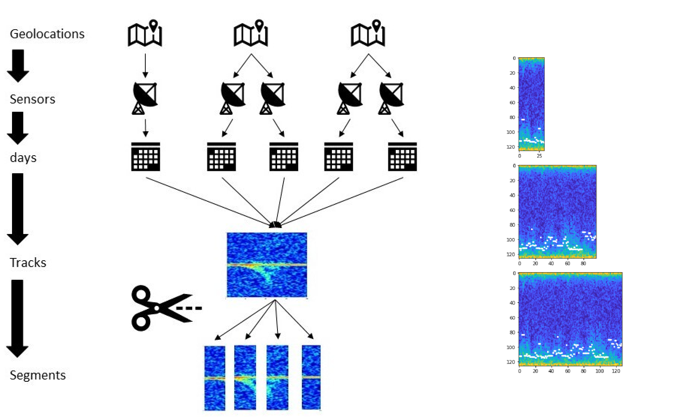
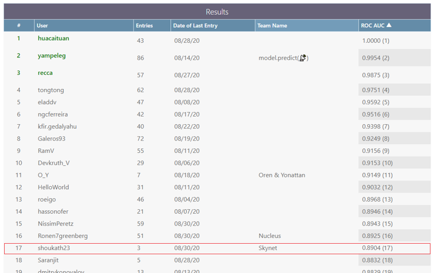

## MAFAT Radar Challenge 

Distinguish between humans and animals in radar tracks. 
The goal is to accurately classify whether a radar signal segment represents a human or an animal.

## Overview
Recent developments in radar technologies allow for the development of powerful doppler-pulse radars. Those radars are used in different areas and applications, including security. Radars monitor large areas, and detect and track moving objects. Object classification, i.e., determination of the type of the tracked object, is essential for systems such as these. While some object types are easily distinguishable from one another by traditional signal processing techniques, distinguishing between humans and animals, which are non-rigid objects, tracked in radars, is a difficult task.

Today, the task of classifying radar-tracked, non-rigid objects is mostly done by human operators and requires the integration of radar and optical systems. The growing workload of those operators and the complexity of the systems is a major constraint for improving the systems’ efficiency. The competition’s objective is to explore automated, novel solutions that will enable classification for humans and animals that are tracked by radar systems with a high degree of confidence and accuracy.

The participants’ goal is to classify segments of radar tracks of humans or animals using the I/Q signal matrix as an input. The task at hand is a binary classification task; the tracked objects are either humans or animals.

The data is real-world data, gathered from diverse geographical locations, different times, sensors, and qualities (high- and low-signal to noise ratio—SNR).

## The Competition’s Goal
The competition’s objective is to explore automated, novel solutions that will enable the classification of humans and animals that are tracked by radar systems with a high degree of confidence and accuracy. The participants’ goal is to classify segments of radar tracks of humans or animals using the I/Q signal matrix as an input. The task at hand is a binary classification task; the tracked objects are either humans or animals.

### Why is this a difficult task?
Classification of radar-tracked objects is traditionally done by using well-studied radar signal features. For example, the Doppler effect, also known as the Doppler shift, and the radar cross-section of an object can be utilized for the classification task, however, from the radar system’s perspective, looking at the tracked objects through the lens of those traditional features, humans and animals appear very similar.

Microwave signals travel at the speed of light but still obey the Doppler effect. Microwave radars receive a Doppler frequency shifted reflection from a moving object. Frequency is shifted higher for approaching objects and lower for receding objects. The Doppler effect is a strong feature for some classification tasks, e.g., separating moving vehicles from animals. However, humans and animals are typically moving at the same range of velocities.

Humans and animals are non-rigid objects. While walking, different body parts move at different velocities and frequencies (arms, legs, body center or torso, etc.). The micro-Doppler signature of a tracked object is a time-varying frequency-modulated contribution that is caused by the relative movement of separate parts of the moving objects. Potentially, the micro-Doppler phenomenon can produce features that are useful for the task of classifying non-rigid moving objects.

The radar cross-section (RCS) is a measure of how detectable an object is by radar. An object reflects a limited amount of radar energy back to the source, and this reflected energy is used to calculate the RCS of an object. A larger RCS indicates that an object is more easily detected by radars. Multiple factors contribute to the RCS of an object, including its size, material, shape, orientation, and more. The RCS is a classic feature for classifying the tracked object. However, it turns out that the RCS of humans is similar to the RCS of many animals; thus, on its own, RCS is not a good enough separating feature as well.

The task of automatically distinguishing between humans and animals based on their radar signature is, therefore, a challenging task!

The objective of this competition is to explore whether creative approaches and techniques, including deep convolutional neural networks, recurrent neural networks, transformers, classical machine learning, classical signal processing, and more, can be leveraged to provide better solutions for this difficult task. We are especially interested in approaches that are inspired by non-radar fields, including computer vision, audio analysis, sequential data analysis, and so on.
 
## Radar tracks spectrograms (visual representation of the I/Q signal matrix)

### The Data
The data is real-world data gathered from diverse geographical locations, different times, sensors, and qualities (high- and low-signal to noise ratio—SNR).

The dataset consists of signals recorded by ground doppler-pulse radars. Each radar “stares” at a fixed, wide area of interest. Whenever an animal or a human moves within the radar’s covered area, it is detected and tracked. The dataset contains records of those tracks. The tracks in the dataset are split into 32 time-unit segments. Each record in the dataset represents a single segment. The dataset is split to training and test sets; the training set contains the actual labels (humans or animals). 

A segment consists of a matrix with I/Q values and metadata. The matrix of each segment has a size of 32x128. The X-axis represents the pulse transmission time, also known as “slow-time”. The Y-axis represents the reception time of signals with respect to pulse transmission time divided into 128 equal sized bins, also known as “fast-time”. The Y-axis is usually referred to as “range” or “velocity” as wave propagation depends on the speed of light. For example, for Pulse Repetition Interval (PRI) of 128 ms, each Y-axis is a bin of 1 ms. For pulse sent in t(n) and a signal received in t(n+m) where 0<m<=128 the signal is set in the “m” bin of pulse n (the numbers are not the real numbers and are given only for the sake of the example).

The radar’s raw, original received signal is a wave defined by amplitude, frequency, and phase. Frequency and phase are treated as a single-phase parameter. Amplitude and phase are represented in polar coordinates relative to the transmitted burst/wave. Polar coordinate calculations require frequent sine operations, making calculations time-consuming. Therefore, upon reception, the raw data is converted to cartesian coordinates, i.e., I/Q values. The values in the matrix are complex numbers: I represents the real part, and Q represents the imaginary part.

The I/Q matrices that are supplied to participants have been standardized, but they have not been transformed or processed in any other way. Therefore, the data represents the raw signal. Different preprocessing and transformation methods, such as Fourier transform, can and should be used in order to model the data and extract meaningful features. For more information, see “Signal Processing” methods or view the links at the bottom for more information.

The metadata of a segment includes track id, location id, location type, day index, sensor id and the SNR level. The segments were collected from several different geographic locations, a unique id was given per location. Each location consists of one or more sensors, a sensor belongs to a single location. A unique id was given per sensor. Each sensor has been used in one or more days, each day is represented by an index. A single track appears in a single location, sensor and day. The segments were taken from longer tracks, each track was given a unique id.

## **Data Preprocessing**
**The preprocessing main steps:**   
1. Applying [DFT](https://en.wikipedia.org/wiki/Discrete_Fourier_transform) (Discrete Fourier transform) by using the fast Fourier transform algorithm ([FFT](https://en.wikipedia.org/wiki/Fast_Fourier_transform)) and [Hann function](https://www.mathworks.com/help/signal/ref/hann.html) to smooth the I/Q matrix. Afterward, calculating the absolute value of the I/Q matrix complex numbers.   
More information about Windowing and Hann function:   
[Wikipedia Hann](https://en.wikipedia.org/wiki/Hann_function#:~:text=The%20Hann%20function%20of%20length,can%20be%20even%20or%20odd.)   
[Wikipedia Window function](https://en.wikipedia.org/wiki/Window_function)   
2. Set max value on the center of the target's mass.   
The doppler burst is a vector (1 x 32) that marks the center of the target's mass on each I/Q matrix in every time unit (32 time-units).   
The preprocess sets the maximum value of each I/Q matrix in-place of the values at the center of the target's mass.
3. Normalization - Transforming I/Q matrix values to standardized values.   
Subtraction of the mean and division by the standard deviation.

**Preprocessing main steps explained:**   
The DFT converts a signal from its original domain (often time or space) to a representation in the frequency domain and vice versa.   
The I/Q matrix in this challenge is being converted from the velocity domain to the frequency domain.
Windows (like "Hann") are used to reduce spectral leakage when performing a Fourier Transform on time data and converting it into the frequency domain.

The purpose of switching the values of the center of the target's mass in the I/Q matrix with the max value of the matrix is to enhance this part of the matrix and focus the model on this part.

Finally, the normalization is used for scaling all the I/Q matrices.

* *Note: the target_type lables are strings ("human" and "animal"), the data_preprocess function replaces them to "human" = 1 and "animal" = 0.*   
   
**The FFT Process Explained:**   
The IQ matrix contains 32 x 128 elements being 128 I/Q time data samples within a single radar processing time frame and 32 consecutive such time units. The X-axis represents the pulse transmission time, also known as “slow-time”. The Y-axis represents the reception time of signals with respect to pulse transmission time divided into 128 equal sized bins, also known as “fast-time”. The reason FFT is performed on the ‘fast time’ axis (i.e. 128 samples) rather than on the ‘slow time’ axis (i.e. 32 samples) is a matter of scale. An underlying assumption for an effective FFT analysis is that ‘acceleration’ during the time frame represented by the data is very low. Given the type of motion presented by humans and animals only the ‘fast time’ axis complies with this assumption.
Therefore, FFT processing should be applied over the dimension of 128 I/Q time samples to get the frequency content of the returned radar signal at each time frame. A spectrogram (as shown in the samples) is generated by attaching together 32 consecutive FFT results (please note that besides FFT processing some additional manipulation is required to properly display a spectrogram – like taking a LOG of the absolute value and passing a threshold – this is well detailed in the ‘Processing’ section of the competition notebook). Therefore, a spectrogram would eventually provide a display of how the frequency content of the returned signal is changing along time.

## Additional Preprocessing

## Noise Removal Auto-Encoder

#### Auto-Encoder prediction results

## Convolutional Neural Network Architecture

Taking inspiration from the ResNet architecture, we implemented a modified Mini-ResNet architecture.

## Final Results

### Leaderboard

Top 10% of the submissions.

